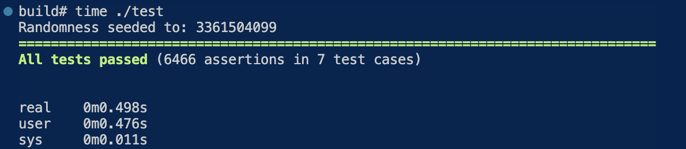

# CS 225 Final Project Report
## Table of Contents
1. [Algorithm Results & Tests](#algorithm-results--tests)
2. [Reflection](#reflection)
3. [Output](#output)
4. [Discussion](#discussion)
- - -

## Algorithm Results & Tests

### DFS Traversal
Summary:
- We performed depth-first search (DFS) traversal on the graph representing the full dataset. During the traversal, we successfully disconnected edges that were negative or “weakly related” using a bound we defined to be 2 to only include sellers with a relatively good trust level (3-10 where 10 is highly trustworthy).

Tests:
- We tested on a small dummy graph, a small subset of the dataset graph, and the full dataset graph to ensure that all edges after the traversal had a weight above the bound.

### Tarjan's Algorithm
Summary:
- We ran Tarjan's algorithm on the graph representing the full dataset. As a result of the algorithm, we successfully determined the strongly connected components in the graph, which represent the “trust networks” between Bitcoin users.

Tests:
-  Since the full dataset was large, manual identification of strongly connected components in the data would have been difficult. For this reason, in order to test Tarjan's algorithm, we tested on a dummy graph to verify that the algorithm output matched all the strongly connected components that we determined manually (the expected output). 

### Dijkstra's Algorithm
Summary:
- We ran Dijkstra's algorithm on graph representing the full dataset. As a result of the algorith, we successfully determined shortest path between Bitcoin sellers and users after reweighting based on levels of trust. The result is filtered with a maximum path length to find a list of users that can be suggested.

Tests:
- Since the full dataset was large, manual identification of strongly connected components in the data would have been difficult. For this reason, in order to test Dijkstra's algorithm, we tested on a dummy graph to verify that the algorithm output matched the shortest path between two users with similar levels of trust that we determined manually (the expected output). 

## Reflection & Discussion
Leading Question: *How closely related and trustworthy are two Bitcoin users on Bitcoin OTC?*

Our goal was to utilize the Bitcoin OTC trust weighted signed network dataset from SNAP (Stanford) to identify existing relationships between Bitcoin users and ultimately determine user trustworthiness.

As a result of our analysis of the dataset via the DFS traversal, Tarjan's Algorithm, and Dijkstra's Algorithm, we were able to answer our leading question. Through this process, we observed that trust networks among Bitcoin users are more densely connected than expected. **By successfully implementing the desired algorithms, we were able to achieve all our project goals and determine the most trustworthy seller to recommend to a specific user.**

## All tests



Note the expected time to run as shown above.


## Valgrind


Note the expected time to run as shown above.


## Output

### Example: Output snippet of strongly connected components

In the below image, the terminal commands to obtain this output and terminal output are shown.


Terminal transcript:
```zsh
./main ../data/soc-sign-bitcoinotc.csv -a scc -o ../test_scc_output.txt

Opening file "../data/soc-sign-bitcoinotc.csv"

Total number of users: 5881
```

In the below image, a snippet of the output of strongly connected components for all user IDs in the full dataset is shown.


Note that the output format, per line, is as follows: <br/>
`SCC [User ID] : [List of User IDs in the same strongly connected component]`

### Example: Output snippet of user's suggestions

In the below image, the terminal commands to obtain this output and terminal output are shown.


Terminal transcript:
```zsh
./main ../data/soc-sign-bitcoinotc.csv -a suggestion -o ../test_suggestion_output.txt

Opening file "../data/soc-sign-bitcoinotc.csv"

Total number of users: 5881

Please enter the user ID:
1803

Please enter the boundary for recommendation:
20
```

In the below image, a snippet of the output of strongly connected components for all user IDs in the full dataset is shown.


Note that the output format, per line, is as follows: <br/>
`[Suggested user ID according to boundary / trust]`

